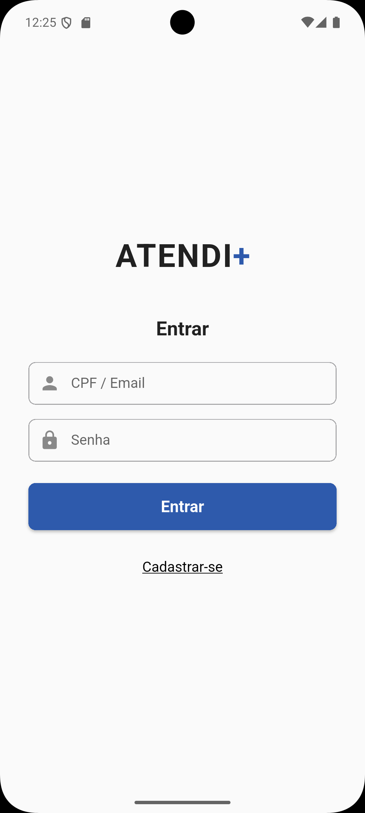

# **Atendi+**

---

## **Descrição do Projeto**
O **Atendi+** é um aplicativo web criado para **melhorar a organização das filas de atendimento em postos de saúde**.  
A proposta é substituir as fichas físicas por uma **fila digital**, trazendo mais **agilidade, transparência e conforto** aos pacientes.

---

## **Problema**
Nos postos de saúde, os pacientes enfrentam **longas esperas**, **falta de informação** sobre a ordem de atendimento e **desorganização** no processo de triagem.

---

## **Solução**
O **Atendi+** digitaliza o processo de atendimento, permitindo:
- Cadastro rápido dos pacientes;  
- Visualização da **posição na fila** e do **tempo estimado de espera**;  
- Envio de **notificações** quando o atendimento estiver próximo;  
- Acesso dos atendentes a um **painel de controle** para gerenciar a fila.

---

## **Objetivos**
- Reduzir o tempo de espera percebido pelos pacientes;  
- Aumentar a transparência no atendimento;  
- Melhorar a comunicação entre pacientes e atendentes;  
- Tornar o processo de atendimento mais simples e moderno.  

---

## **Tecnologias Utilizadas**
- **Frontend e Backend:** Flutter  
- **Banco de Dados:** Firebase  
- **Design e Protótipos:** Figma  
- **Gerenciamento do Projeto:** GitHub Projects  

---

## **Funcionamento do App**
1. O paciente faz login com **CPF e senha**;  
2. O paciente pode **registrar-se em uma fila**;  
3. Pode **ver sua posição na fila** e o **tempo estimado**;  
4. Pode **ativar notificações**;  
5. O atendente controla os atendimentos no painel administrativo.  

---

## **Telas do Aplicativo**
**Tela de Login:**  

**Tela de Cadastro:**  

**Tela de Menu Principal:**  

**Tela da Fila de Atendimento:**  

**Card de Notificações:**  

**Modal de Confirmação:**  

---

## **Conclusão**
O **Atendi+** oferece uma solução prática e acessível para o controle de filas em unidades de saúde, trazendo **mais organização, eficiência e transparência** ao processo de atendimento.

---
